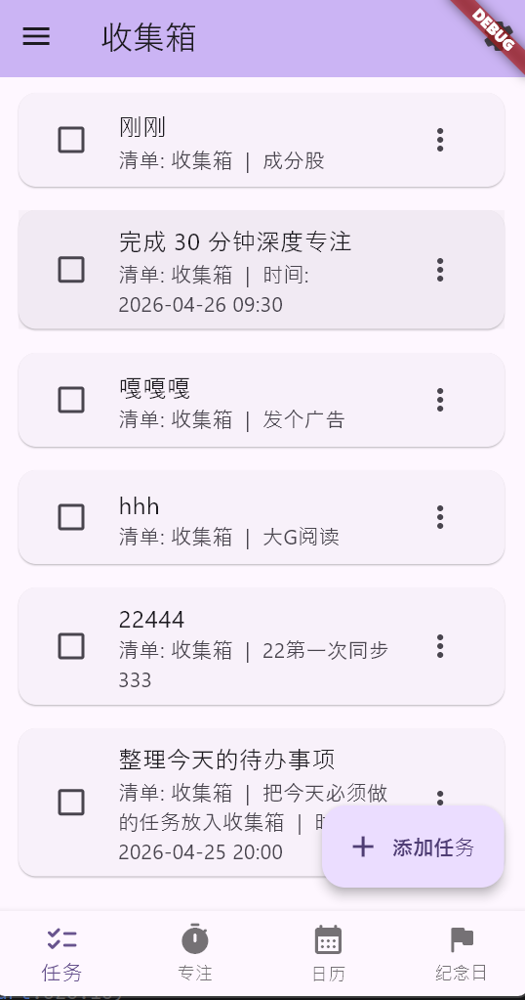
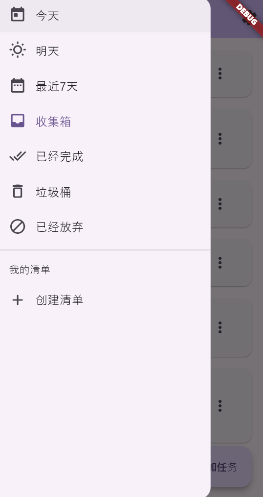
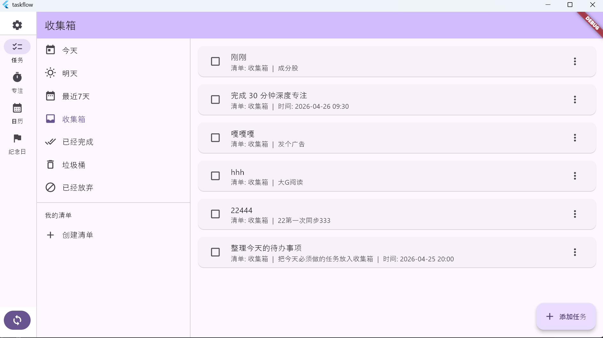

# taskflow

一个轻量的任务清单与纪念日管理应用（本地数据库使用 drift + SQLite），用于管理每日任务、专注模式、日历视图与重要纪念日提醒。

## 主要特点

- 底部导航：任务、专注、日历、纪念日
- 任务侧边栏分类：今天、明天、最近7天、收集箱、已经完成、垃圾桶、已经放弃
- 任务支持本地持久化（drift + SQLite）
- 点击任务进入详情编辑：时间、名称、描述、位置
- 简洁的 UI 与离线优先的数据层设计，便于私有化部署与本地使用

## 技术栈

- Flutter（前端）
- Dart
- drift + SQLite（本地持久化）
- Repository + DAO 层结构

## 数据层结构（概要）

- `lib/data/local/app_database.dart`: 数据库入口与初始化  
- `lib/data/local/tables/`: 表定义（`tasks`、`ops`、`devices`、`sync_states` 等）  
- `lib/data/local/daos/`: DAO 层（CRUD、watch、replay）  
- `lib/data/task_repository.dart`: Repository 封装（页面调用入口）  
- `lib/data/sync/sync_engine.dart`: 同步引擎接口（当前提供 noop 实现）

## 代码生成（drift）

```powershell
dart run build_runner build --delete-conflicting-outputs
```

## 快速运行

```powershell
flutter pub get
flutter run
```

## 运行测试

```powershell
flutter test
```

## 软件截图

<div>

 
 

</div>
<div>

</div>

## 许可证（License）

本项目采用 Affero General Public License v3（AGPL-3.0）。选择 AGPL v3 意味着：如果您修改并对外提供基于本项目的网络服务，必须以同等 AGPL v3 许可证开源所做的修改和衍生代码。

- 许可证文本与详情：https://www.gnu.org/licenses/agpl-3.0.html

```
Copyright (c) <2026-4> <calmpunct>

This program is free software: you can redistribute it and/or modify
it under the terms of the GNU Affero General Public License as published by
the Free Software Foundation, either version 3 of the License, or
(at your option) any later version.
```
